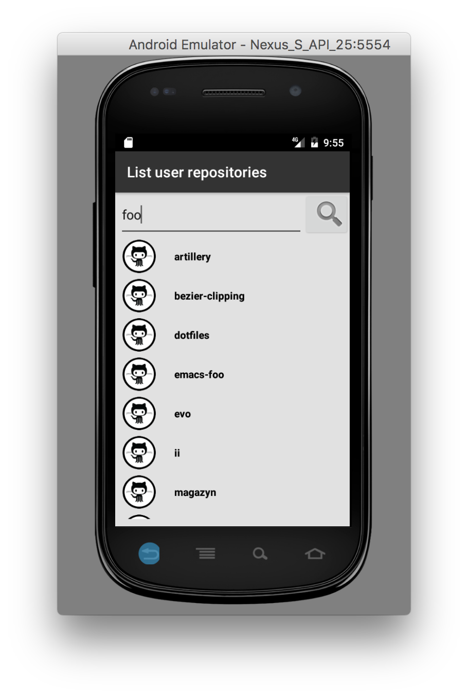
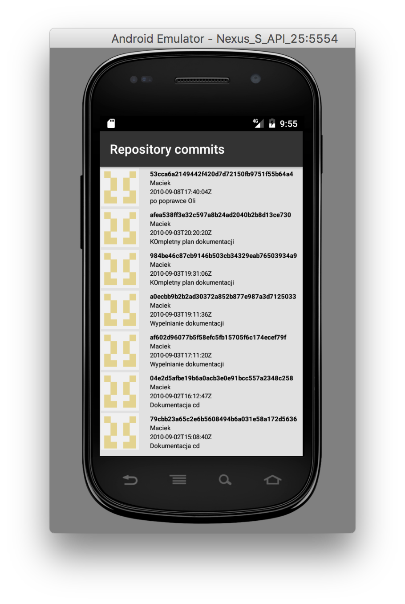

# github-app
Tiny Android app to view Github repositories over Github V3 Rest API

Branches
* kotlin = kotlin port with Retrofit based github client
* master = original java version with async http based github client

  
  

